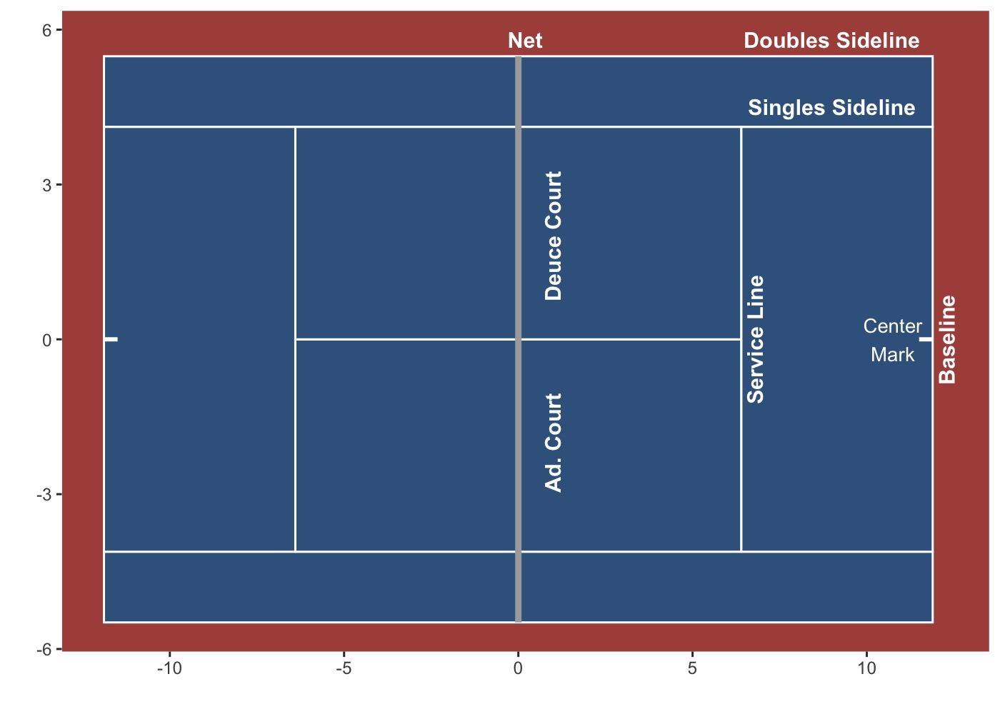

### ReadME

This repo contains all code written for the `The Analysis of Serve Decisions in Tennis using Bayesian Hierarchical Models` paper.

* The bayesian model were applied only on Roland Garros tracking data, however similar tracking data from the Australian Open is available too.

* The scraped tracking data (from RG's Court Vision feature) was saved in early December 2020. 

`modelling`
-----------
* `fit_all_stan_models.R`
  * Fit and save all Bayesian models of interest 
  * Compare model fits via WAIC (using LOO R package)

 * `get_expanded_model_results.R`
   * Look at posterior results for the expanded model (player-varying intercepts + common covariates)

* `diagnose_player_varying_effects.R`
  * Fit all Bayesian models using approximation methods (prototypes)

* `/saved_models/`
  * `/stan_loglik/`: Model results using STAN. Pointwise log-likelihoods are included (for model fit diagnostics).
  * `/advi/`: Model results using posterior approximation

 * `/stan_files/`
   * Contains all .stan files

 * `plot_player_varying_intercept.R`
   * Plot player-varying model intercepts
   * `/compare_intercepts_probs/` directory contains intermediate data files produced to help produce player-varying intercept plots

* `apply_posterior_prediction.R`
  * Plot posterior prediction of expanded model (Roger Federer Illustration)

  * `/plots/`
    * All model result plots

* Obtain Posterior predictions
* Plot model results (eg: compare player-varying intercepts)

`data`
--------------
* Processed tracking data from Roland Garros along with scraped data of player heights
* Unfortunately, the data is not included.

`eda`
------
* Plots for the EDA section
* Eg: Federer's point importance, serve speeds vs serve number, player-specific heatmaps

`src`
-----
* Contains some functions that I repeatedly use throughout the project

Court dimensions are labelled in metres. For convenience, here's a plot.

